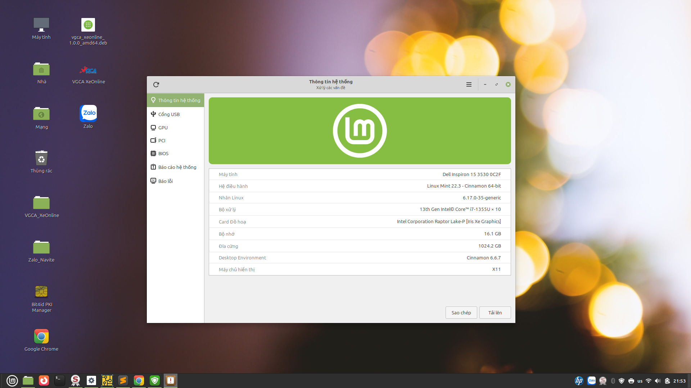
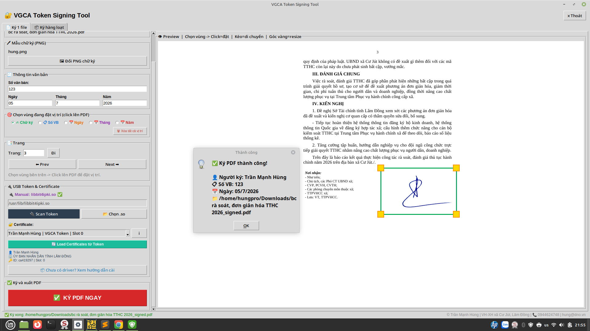
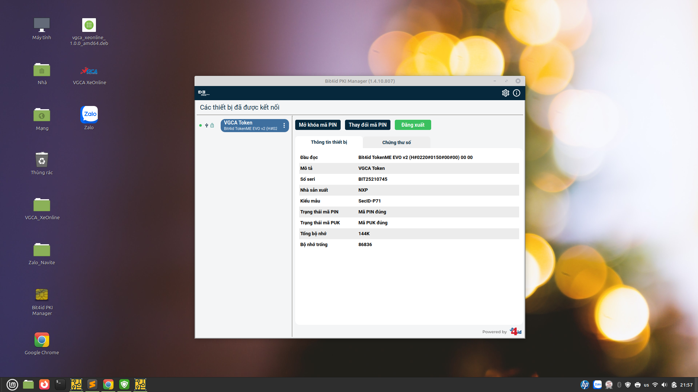
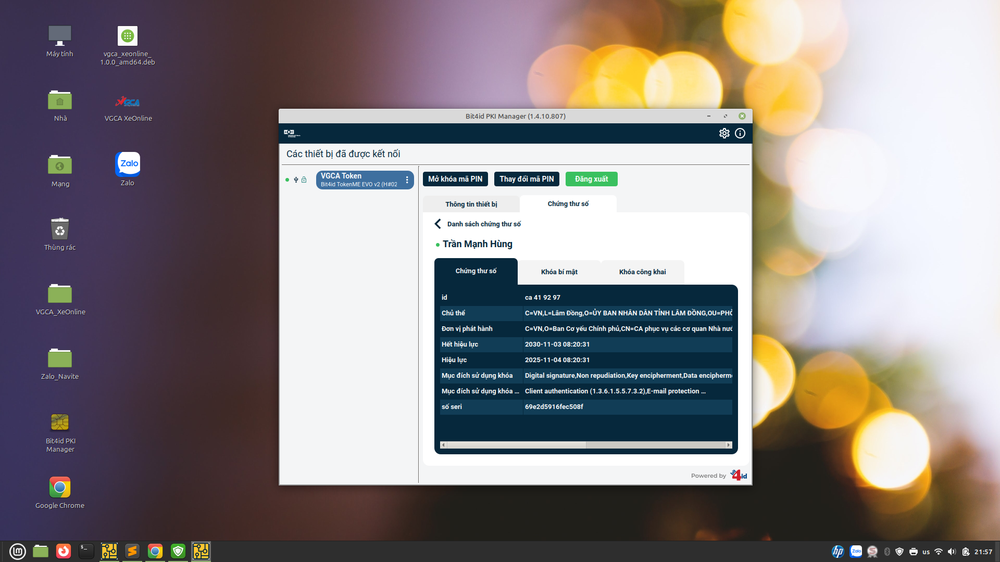
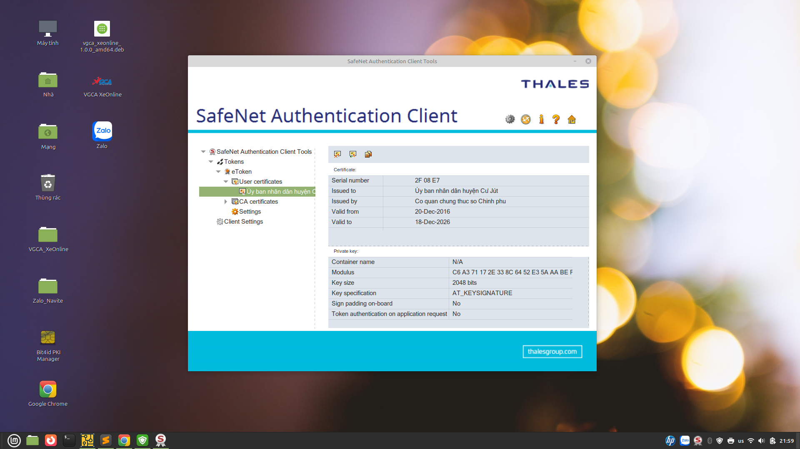
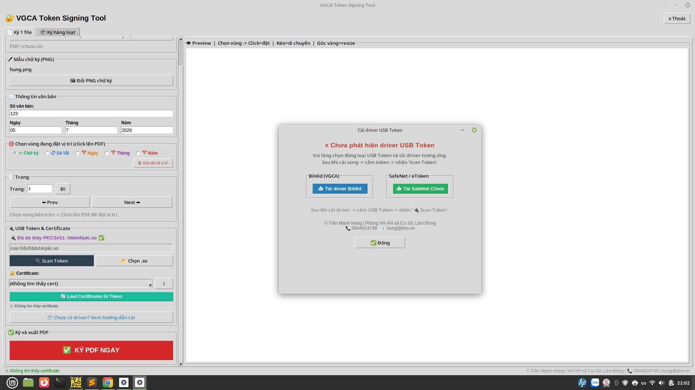

<div align="center">


# VGCA XeOnline

### Linux Digital Signature Platform

**Offline PDF Signing • PKCS#11 • USB Token • Chrome Extension • Native Messaging**

---

Linux Mint • Ubuntu • PDF • PKCS#11 • Python

</div>

---

# 📖 Giới thiệu

**VGCA XeOnline** là phần mềm ký số PDF dành cho Linux, được phát triển nhằm hỗ trợ ký số tài liệu điện tử bằng USB Token thông qua chuẩn **PKCS#11**.

Dự án hướng đến việc xây dựng một nền tảng ký số hoạt động hoàn toàn ngoại tuyến (Offline), hỗ trợ nhiều loại USB Token và dễ dàng tích hợp với trình duyệt thông qua Chrome Extension và Native Messaging.

---

# ✨ Tính năng

- ✅ Ký số PDF
- ✅ Ký hàng loạt (Batch Sign)
- ✅ Đóng dấu PNG
- ✅ Xem trước PDF
- ✅ Drag & Drop PDF
- ✅ PKCS#11
- ✅ Tự động nhận USB Token
- 🚧 Setup Wizard
- 🚧 Health Check
- 🚧 Multi Token

---

# 🖥 Hệ điều hành hỗ trợ

| Hệ điều hành | Trạng thái |
|--------------|-----------|
| Linux Mint 22 | ✅ |
| Ubuntu 24.04 LTS | ✅ |
| Debian 12 | 🧪 |
| Fedora | 🚧 |

---

# 🔐 USB Token hỗ trợ

| USB Token | Trạng thái |
|------------|-----------|
| Bit4id | ✅ |
| SafeNet eToken | ✅ |
| SafeNet IDPrime | 🧪 |
| VNPT-CA | 🚧 |
| Viettel-CA | 🚧 |
| FPT-CA | 🚧 |

---

# 📷 Hình ảnh

## Môi trường thử nghiệm

<p align="center">

</p>

---

## Ký số PDF

<p align="center">

</p>

---

## Bit4id PKI Manager

<p align="center">

</p>

---

## Thông tin chứng thư số

<p align="center">

</p>

---

## SafeNet Authentication Client

<p align="center">

</p>

---

## Hướng dẫn cài Driver

<p align="center">

</p>

---

# 🏗 Kiến trúc

```
GUI
 │
 ▼
Core Services
 │
 ├─────────────┐
 ▼             ▼
PDF Engine   PKCS#11 Engine
                 │
                 ▼
      USB Token Driver
                 │
        ┌────────┴────────┐
        ▼                 ▼
     Bit4id           SafeNet
```

---

# 📂 Cấu trúc Project

```
VGCA_XeOnline/

├── build_deb/
├── chrome-extension/
├── core/
├── docs/
│   ├── images/
│   └── screenshots/
├── gui/
├── navite/
├── main.py
├── native_host.py
├── requirements.txt
└── README.md
```

---

# 🚀 Cài đặt

```bash
git clone https://github.com/TranManhHungDNO/VGCA_XeOnline.git

cd VGCA_XeOnline

python3 -m venv .venv

source .venv/bin/activate

pip install -r requirements.txt

python main.py
```

---

# 🧪 Kiểm thử

Đã kiểm thử thành công:

- Linux Mint 22.3
- Ubuntu 24.04
- VMware Workstation
- Bit4id PKI Manager
- SafeNet Authentication Client
- PDF Signing
- PKCS#11

---

# 🛣 Roadmap

### v0.9

- Linux Baseline
- Bit4id
- SafeNet
- PDF Signing

### v0.91

- SafeNet Compatibility

### v0.92

- Multi USB Token

### v0.95

- Setup Wizard

### v1.0

- Stable Release

---

# 📚 Tài liệu

```
docs/

├── ARCHITECTURE.md
├── CHANGELOG.md
├── ROADMAP.md
├── TEST_REPORT.md
└── BUGS.md
```

---

# 👨‍💻 Tác giả

**Trần Mạnh Hùng**

Phòng Văn hóa - Xã hội xã Cư Jút, tỉnh Lâm Đồng
SĐT/ZL: 0944624748 - hungtm.cujut@lamdong.gov.vn
https://dno.vn 

---

<div align="center">

Made with ❤️ in Vietnam 🇻🇳

</div>
